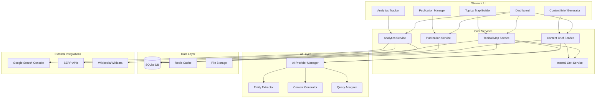
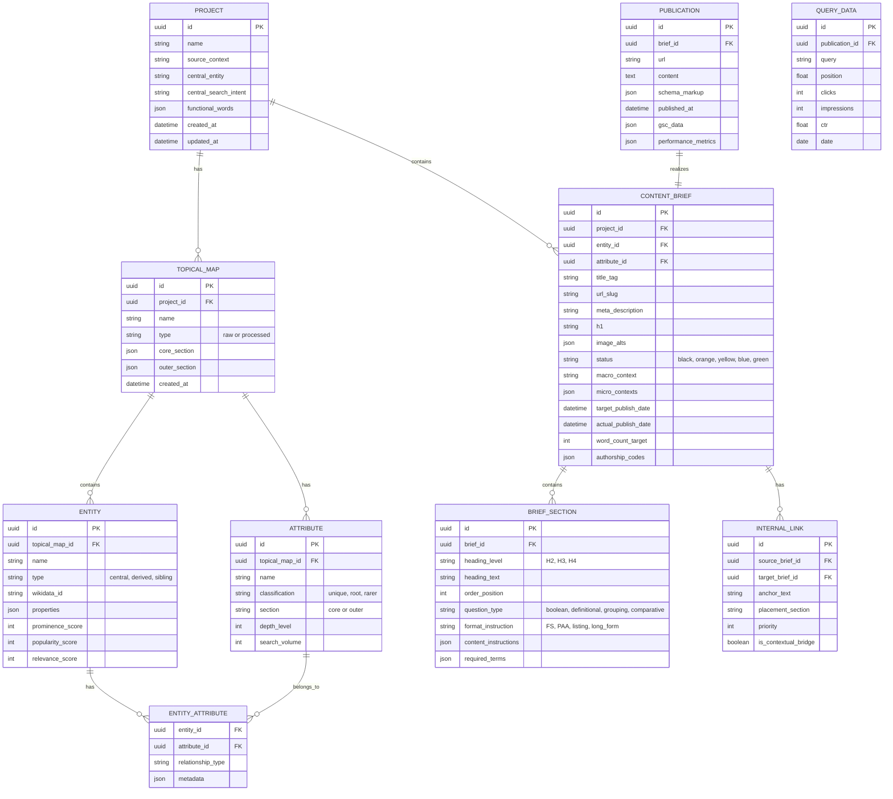
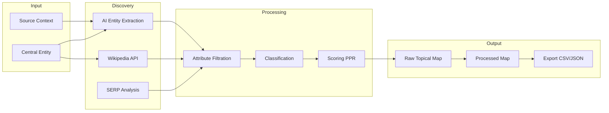
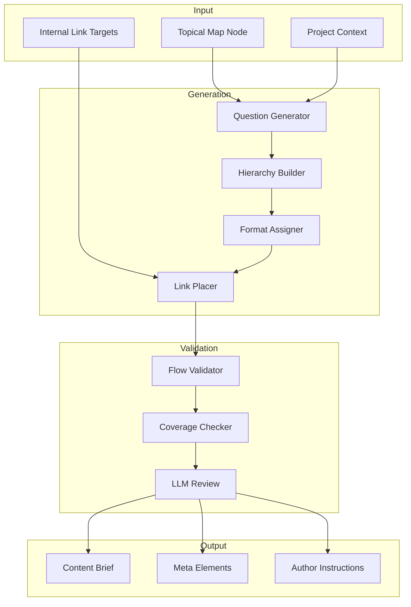
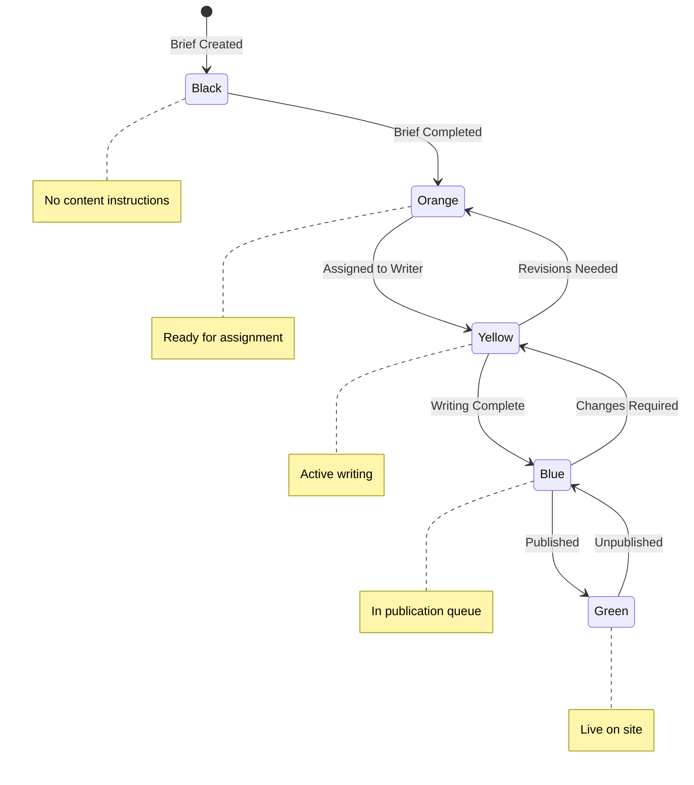
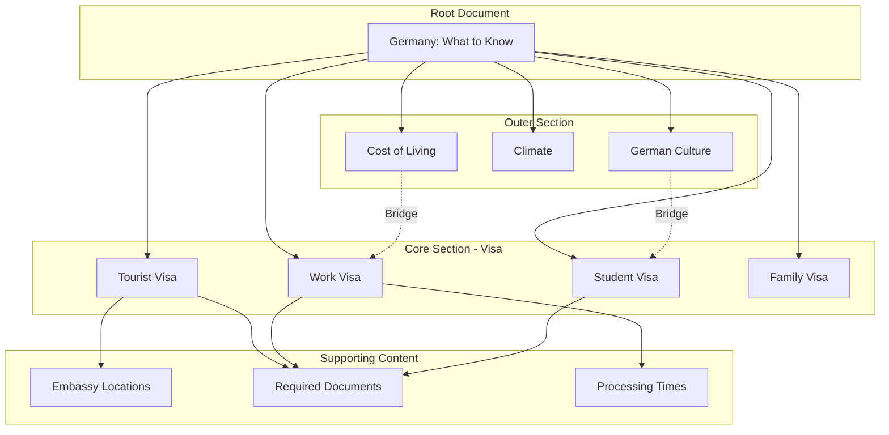

# Semantic SEO Platform Architecture

## Based on Koray Tuğberk GÜBÜR's Framework

---

## Executive Summary

This document defines the architecture for a **Full Semantic SEO Platform** that implements Koray's Semantic SEO Framework. The platform covers the complete workflow from Topical Mapping through Content Briefs, Publication Management, and Performance Tracking.

**Key Characteristics:**
- Single-user desktop application with optional cloud sync
- Local SQLite database with cloud export capabilities
- Flexible AI provider integration (OpenRouter, OpenAI, Anthropic, Gemini)
- Modular architecture for extensibility

---

## 1. Source Context & Central Entity (Meta-Framework)

Before diving into technical architecture, we apply Koray's framework to define the app itself:

| Concept | Application to This Platform |
|---------|------------------------------|
| **Source Context** | SEO Professional Tool - Content Strategy & Authority Building |
| **Central Entity** | Semantic Content Network |
| **Central Search Intent** | Planning, Creating, and Managing Topical Authority |
| **Core Section** | Topical Maps, Content Briefs, Publication Pipeline |
| **Outer Section** | Analytics, AI Insights, Performance Tracking |

---

## 2. Technology Stack Recommendation

### Recommended Stack

```
┌─────────────────────────────────────────────────────────────┐
│                    PRESENTATION LAYER                        │
│  ┌─────────────────────────────────────────────────────┐    │
│  │              Streamlit UI Framework                  │    │
│  │    - Multi-page navigation                          │    │
│  │    - Interactive components                         │    │
│  │    - Data visualization (Plotly, Altair)           │    │
│  │    - Session state management                       │    │
│  └─────────────────────────────────────────────────────┘    │
├─────────────────────────────────────────────────────────────┤
│                    APPLICATION LAYER                         │
│  ┌─────────────────────────────────────────────────────┐    │
│  │              FastAPI Backend (Optional)              │    │
│  │    - REST API endpoints                             │    │
│  │    - Background task processing                     │    │
│  │    - WebSocket for real-time updates               │    │
│  └─────────────────────────────────────────────────────┘    │
├─────────────────────────────────────────────────────────────┤
│                    BUSINESS LOGIC LAYER                      │
│  ┌──────────┐ ┌──────────┐ ┌──────────┐ ┌──────────┐       │
│  │ Topical  │ │ Content  │ │Publication│ │Analytics │       │
│  │   Map    │ │  Brief   │ │ Manager  │ │  Engine  │       │
│  │ Builder  │ │Generator │ │          │ │          │       │
│  └──────────┘ └──────────┘ └──────────┘ └──────────┘       │
├─────────────────────────────────────────────────────────────┤
│                    AI/LLM INTEGRATION LAYER                  │
│  ┌─────────────────────────────────────────────────────┐    │
│  │              AI Provider Abstraction                 │    │
│  │    - OpenRouter (multi-model access)                │    │
│  │    - OpenAI (GPT-4, GPT-4o)                        │    │
│  │    - Anthropic (Claude)                             │    │
│  │    - Google (Gemini)                                │    │
│  └─────────────────────────────────────────────────────┘    │
├─────────────────────────────────────────────────────────────┤
│                    DATA LAYER                                │
│  ┌──────────────────┐  ┌──────────────────┐                │
│  │  SQLite (Local)  │  │  Cloud Sync      │                │
│  │  - Projects      │  │  - Supabase      │                │
│  │  - Topical Maps  │  │  - Firebase      │                │
│  │  - Briefs        │  │  - Custom API    │                │
│  │  - Content       │  │                  │                │
│  └──────────────────┘  └──────────────────┘                │
└─────────────────────────────────────────────────────────────┘
```

### Why This Stack?

| Component | Rationale |
|-----------|-----------|
| **Streamlit** | Rapid development, consistent with existing tools, powerful data viz, great for complex forms |
| **FastAPI** | Optional API layer for background tasks, enables future web/mobile clients |
| **SQLite** | Zero-config local storage, portable, excellent for single-user |
| **OpenRouter** | Single API for multiple AI providers, cost-effective |

---

## 3. System Architecture Overview



---

## 4. Database Schema Design

### Entity Relationship Diagram



### SQLite Schema

```sql
-- Projects table
CREATE TABLE projects (
    id TEXT PRIMARY KEY,
    name TEXT NOT NULL,
    source_context TEXT,
    central_entity TEXT,
    central_search_intent TEXT,
    functional_words TEXT, -- JSON array
    created_at DATETIME DEFAULT CURRENT_TIMESTAMP,
    updated_at DATETIME DEFAULT CURRENT_TIMESTAMP
);

-- Topical Maps table
CREATE TABLE topical_maps (
    id TEXT PRIMARY KEY,
    project_id TEXT NOT NULL,
    name TEXT NOT NULL,
    type TEXT CHECK(type IN ('raw', 'processed')) DEFAULT 'raw',
    core_section TEXT, -- JSON
    outer_section TEXT, -- JSON
    created_at DATETIME DEFAULT CURRENT_TIMESTAMP,
    FOREIGN KEY (project_id) REFERENCES projects(id) ON DELETE CASCADE
);

-- Entities table
CREATE TABLE entities (
    id TEXT PRIMARY KEY,
    topical_map_id TEXT NOT NULL,
    name TEXT NOT NULL,
    type TEXT CHECK(type IN ('central', 'derived', 'sibling')) DEFAULT 'derived',
    wikidata_id TEXT,
    properties TEXT, -- JSON
    prominence_score INTEGER DEFAULT 0,
    popularity_score INTEGER DEFAULT 0,
    relevance_score INTEGER DEFAULT 0,
    FOREIGN KEY (topical_map_id) REFERENCES topical_maps(id) ON DELETE CASCADE
);

-- Attributes table
CREATE TABLE attributes (
    id TEXT PRIMARY KEY,
    topical_map_id TEXT NOT NULL,
    name TEXT NOT NULL,
    classification TEXT CHECK(classification IN ('unique', 'root', 'rarer')),
    section TEXT CHECK(section IN ('core', 'outer')) DEFAULT 'core',
    depth_level INTEGER DEFAULT 1,
    search_volume INTEGER DEFAULT 0,
    FOREIGN KEY (topical_map_id) REFERENCES topical_maps(id) ON DELETE CASCADE
);

-- Entity-Attribute relationships
CREATE TABLE entity_attributes (
    entity_id TEXT NOT NULL,
    attribute_id TEXT NOT NULL,
    relationship_type TEXT,
    metadata TEXT, -- JSON
    PRIMARY KEY (entity_id, attribute_id),
    FOREIGN KEY (entity_id) REFERENCES entities(id) ON DELETE CASCADE,
    FOREIGN KEY (attribute_id) REFERENCES attributes(id) ON DELETE CASCADE
);

-- Content Briefs table
CREATE TABLE content_briefs (
    id TEXT PRIMARY KEY,
    project_id TEXT NOT NULL,
    entity_id TEXT,
    attribute_id TEXT,
    title_tag TEXT,
    url_slug TEXT,
    meta_description TEXT,
    h1 TEXT,
    image_alts TEXT, -- JSON array
    status TEXT CHECK(status IN ('black', 'orange', 'yellow', 'blue', 'green')) DEFAULT 'black',
    macro_context TEXT,
    micro_contexts TEXT, -- JSON array
    target_publish_date DATETIME,
    actual_publish_date DATETIME,
    word_count_target INTEGER,
    authorship_codes TEXT, -- JSON
    created_at DATETIME DEFAULT CURRENT_TIMESTAMP,
    updated_at DATETIME DEFAULT CURRENT_TIMESTAMP,
    FOREIGN KEY (project_id) REFERENCES projects(id) ON DELETE CASCADE,
    FOREIGN KEY (entity_id) REFERENCES entities(id),
    FOREIGN KEY (attribute_id) REFERENCES attributes(id)
);

-- Brief Sections table
CREATE TABLE brief_sections (
    id TEXT PRIMARY KEY,
    brief_id TEXT NOT NULL,
    heading_level TEXT CHECK(heading_level IN ('H2', 'H3', 'H4', 'H5')),
    heading_text TEXT NOT NULL,
    order_position INTEGER NOT NULL,
    question_type TEXT CHECK(question_type IN ('boolean', 'definitional', 'grouping', 'comparative', 'none')),
    format_instruction TEXT CHECK(format_instruction IN ('FS', 'PAA', 'listing', 'long_form', 'table')),
    content_instructions TEXT, -- JSON
    required_terms TEXT, -- JSON array
    FOREIGN KEY (brief_id) REFERENCES content_briefs(id) ON DELETE CASCADE
);

-- Internal Links table
CREATE TABLE internal_links (
    id TEXT PRIMARY KEY,
    source_brief_id TEXT NOT NULL,
    target_brief_id TEXT NOT NULL,
    anchor_text TEXT,
    placement_section TEXT,
    priority INTEGER DEFAULT 5,
    is_contextual_bridge BOOLEAN DEFAULT FALSE,
    FOREIGN KEY (source_brief_id) REFERENCES content_briefs(id) ON DELETE CASCADE,
    FOREIGN KEY (target_brief_id) REFERENCES content_briefs(id) ON DELETE CASCADE
);

-- Publications table
CREATE TABLE publications (
    id TEXT PRIMARY KEY,
    brief_id TEXT NOT NULL UNIQUE,
    url TEXT,
    content TEXT,
    schema_markup TEXT, -- JSON
    published_at DATETIME,
    gsc_data TEXT, -- JSON
    performance_metrics TEXT, -- JSON
    FOREIGN KEY (brief_id) REFERENCES content_briefs(id) ON DELETE CASCADE
);

-- Query Data table (GSC import)
CREATE TABLE query_data (
    id TEXT PRIMARY KEY,
    publication_id TEXT NOT NULL,
    query TEXT NOT NULL,
    position REAL,
    clicks INTEGER DEFAULT 0,
    impressions INTEGER DEFAULT 0,
    ctr REAL,
    date DATE,
    FOREIGN KEY (publication_id) REFERENCES publications(id) ON DELETE CASCADE
);

-- Indexes for performance
CREATE INDEX idx_briefs_project ON content_briefs(project_id);
CREATE INDEX idx_briefs_status ON content_briefs(status);
CREATE INDEX idx_entities_map ON entities(topical_map_id);
CREATE INDEX idx_attributes_map ON attributes(topical_map_id);
CREATE INDEX idx_query_data_publication ON query_data(publication_id);
CREATE INDEX idx_query_data_date ON query_data(date);
```

---

## 5. Module 1: Topical Map Builder

### Purpose
Create and manage Raw and Processed Topical Maps following Koray's Entity-Attribute methodology.

### Features

```
┌────────────────────────────────────────────────────────────────┐
│                    TOPICAL MAP BUILDER                          │
├────────────────────────────────────────────────────────────────┤
│  1. PROJECT SETUP                                               │
│     ├── Define Source Context                                   │
│     ├── Identify Central Entity                                 │
│     ├── Establish Central Search Intent                         │
│     └── Set Functional Words (predicates)                       │
│                                                                 │
│  2. RAW TOPICAL MAP                                            │
│     ├── Entity Discovery (AI + Wikipedia/Wikidata)             │
│     ├── Attribute Listing                                       │
│     │   ├── Core Section (monetization)                        │
│     │   └── Outer Section (trust/historical)                   │
│     ├── Attribute Filtration                                    │
│     │   ├── Prominence Score                                    │
│     │   ├── Popularity Score (search volume)                   │
│     │   └── Relevance Score (to Source Context)                │
│     └── Attribute Classification                                │
│         ├── Unique Attributes                                   │
│         ├── Root Attributes                                     │
│         └── Rarer Attributes                                    │
│                                                                 │
│  3. PROCESSED TOPICAL MAP                                       │
│     ├── Title Tag Generation                                    │
│     ├── URL Slug Creation (No repetition rule)                 │
│     ├── Meta Description Templates                              │
│     ├── Image ALT Text Suggestions                             │
│     └── Hierarchy Assignment                                    │
│                                                                 │
│  4. VISUALIZATION                                               │
│     ├── Mind Map View                                           │
│     ├── Hierarchy Tree                                          │
│     ├── Entity Relationship Graph                               │
│     └── Coverage Heatmap                                        │
└────────────────────────────────────────────────────────────────┘
```

### Data Flow



### AI Prompts for Entity Discovery

```python
ENTITY_DISCOVERY_PROMPT = """
You are a Semantic SEO expert following Koray Tuğberk GÜBÜR's framework.

Given:
- Source Context: {source_context}
- Central Entity: {central_entity}
- Central Search Intent: {central_search_intent}

Task: Generate a comprehensive list of Entity-Attribute pairs organized into:

1. CORE SECTION (directly tied to monetization):
   - List attributes that define the entity's commercial value
   - Include deep hierarchy (e.g., for "Visa": D-type, C-type, Tourist, Work Permit)
   
2. OUTER SECTION (builds trust and historical data):
   - List attributes that show comprehensive entity understanding
   - Include shallow hierarchy (existence proof, not infinite depth)

For each attribute, provide:
- Name
- Classification: Unique / Root / Rarer
- Prominence: Can the entity be defined without this? (1-10)
- Popularity: Search demand estimate (High/Medium/Low)
- Relevance: Fit with Source Context (1-10)

Output as structured JSON.
"""

ATTRIBUTE_FILTRATION_PROMPT = """
Evaluate these attributes for the entity "{entity}" with source context "{source_context}":

{attributes_list}

For each attribute, determine:
1. Should it be included? (Yes/No)
2. If No, why? (Not Prominent / Not Popular / Not Relevant)
3. Recommended Section: Core or Outer
4. Depth Level: How deep should coverage go? (1-5)

Apply these rules:
- Prominent + Popular + Relevant = Must include in Core
- Prominent + Not Popular + Relevant = Include in Outer
- Not Prominent + Popular + Not Relevant = Exclude
- Popular but Not Relevant = Exclude (even if high volume)
"""
```

### Component Structure

```
modules/
├── topical_map/
│   ├── __init__.py
│   ├── service.py           # Main service orchestration
│   ├── entity_discovery.py  # AI-powered entity extraction
│   ├── attribute_filter.py  # PPR scoring and filtration
│   ├── classifier.py        # Unique/Root/Rarer classification
│   ├── processor.py         # Raw to Processed conversion
│   ├── visualizer.py        # Graph and tree visualizations
│   └── exporter.py          # CSV, JSON, Markdown export
```

---

## 6. Module 2: Content Brief Generator (CorelIS)

### Purpose
Generate comprehensive content briefs following the CorelIS framework: Contextual Vector, Hierarchy, Structure, and Connection.

### Features

```
┌────────────────────────────────────────────────────────────────┐
│                  CONTENT BRIEF GENERATOR                        │
├────────────────────────────────────────────────────────────────┤
│  1. CONTEXTUAL VECTOR (The Flow)                               │
│     ├── Logical question/heading order                         │
│     ├── Straight-line context maintenance                      │
│     ├── Bridge questions between sections                      │
│     └── Macro to Micro context transition                      │
│                                                                 │
│  2. CONTEXTUAL HIERARCHY (The Weight)                          │
│     ├── H2/H3/H4 structure assignment                         │
│     ├── Prominence weighting                                    │
│     ├── Summarization test alignment                           │
│     └── De-emphasis strategies                                  │
│                                                                 │
│  3. CONTEXTUAL STRUCTURE (The Format)                          │
│     ├── Answer format specifications                           │
│     │   ├── Featured Snippet (FS) - under 40 words            │
│     │   ├── PAA - single definitive sentence                  │
│     │   ├── Listing instructions                               │
│     │   └── Long-form mentioning                               │
│     ├── Table specifications (rows, columns)                   │
│     ├── List type definitions                                  │
│     └── Scientific terminology requirements                    │
│                                                                 │
│  4. CONTEXTUAL CONNECTION (Internal Links)                     │
│     ├── Root document link placement                           │
│     ├── Anchor text generation                                  │
│     ├── Link priority ordering                                  │
│     └── Contextual bridge identification                       │
│                                                                 │
│  5. QUESTION ENGINEERING                                        │
│     ├── Boolean questions (Yes/No)                             │
│     ├── Definitional questions (What is...)                    │
│     ├── Grouping questions (Types of...)                       │
│     └── Comparative questions (Best..., Vs...)                 │
│                                                                 │
│  6. META ELEMENTS                                               │
│     ├── Title tag verbalization                                 │
│     ├── Meta description (template recognition)                │
│     ├── URL slug (no repetition rule)                          │
│     └── Image optimization (URL + ALT)                         │
└────────────────────────────────────────────────────────────────┘
```

### Brief Generation Flow



### Content Brief JSON Schema

```json
{
  "brief_id": "uuid",
  "project_id": "uuid",
  "meta": {
    "title_tag": "What to Know Before Going to Germany | Complete Guide",
    "url_slug": "/germany/guide/",
    "meta_description": "Comprehensive guide covering visa requirements, costs, and conditions for living in Germany. Learn about climate, culture, and practical tips.",
    "h1": "What to Know Before Going to Germany",
    "word_count_target": 2500,
    "macro_context": "Germany Travel and Living Guide",
    "micro_contexts": ["Visa Information", "Cost of Living", "Cultural Tips"]
  },
  "image_strategy": {
    "headline_image": {
      "url_format": "germany-guide.jpg",
      "alt_text": "Complete guide to living and traveling in Germany",
      "center_object": "German landmarks collage",
      "text_overlay": "Germany Guide"
    }
  },
  "sections": [
    {
      "order": 1,
      "heading_level": "H2",
      "heading_text": "Where is Germany Located?",
      "question_type": "definitional",
      "format_instruction": "PAA",
      "content_instructions": {
        "answer_style": "Direct answer first, then expansion",
        "required_terms": ["Europe", "Central Europe", "European Union"],
        "internal_link": {
          "target": "/europe/",
          "anchor_text": "European continent",
          "placement": "first paragraph"
        },
        "word_count": 150
      }
    },
    {
      "order": 2,
      "heading_level": "H2",
      "heading_text": "German Climate and Weather",
      "question_type": "definitional",
      "format_instruction": "long_form",
      "content_instructions": {
        "subsections": [
          {"level": "H3", "text": "Temperatures by Season"},
          {"level": "H3", "text": "Best Time to Visit"}
        ],
        "required_terms": ["temperate", "seasons", "rainfall"],
        "table_spec": {
          "rows": 4,
          "columns": ["Season", "Temperature Range", "Conditions"]
        },
        "word_count": 400
      }
    }
  ],
  "authorship_codes": {
    "global": ["scientific_terms", "declaration_first"],
    "section_specific": {
      "1": ["PAA", "explicit_attributes"],
      "2": ["table_format", "measurement_units"]
    }
  },
  "internal_links_plan": [
    {
      "target_brief_id": "uuid-europe",
      "anchor_text": "European continent",
      "priority": 1,
      "placement": "section_1"
    },
    {
      "target_brief_id": "uuid-visa",
      "anchor_text": "German visa requirements",
      "priority": 2,
      "placement": "section_5"
    }
  ],
  "contextual_bridge": {
    "from_macro": "Living in Germany",
    "to_micro": "German Visa Types",
    "bridge_question": "What visa do you need to live in Germany?"
  }
}
```

### AI Prompts for Brief Generation

```python
BRIEF_GENERATION_PROMPT = """
You are a Semantic SEO Content Brief expert following Koray's CorelIS framework.

Given:
- Entity: {entity}
- Attribute: {attribute}
- Source Context: {source_context}
- Central Search Intent: {central_search_intent}
- Internal Link Targets: {link_targets}

Generate a comprehensive content brief with:

1. META ELEMENTS:
   - Title Tag: Use conjunctive words ("and") to create conditional synonyms
   - URL Slug: Apply the "no repetition" rule
   - Meta Description: Mirror title, add attributes (price, duration), follow document structure
   - H1: Reflect the Central Search Intent

2. CONTEXTUAL VECTOR:
   - Create a logical flow of questions/headings
   - Maintain a straight line from introduction to conclusion
   - Include one Bridge Question between macro and micro contexts

3. CONTEXTUAL HIERARCHY:
   - Assign H2/H3/H4 levels based on importance
   - Ensure the summarization test would identify the correct macro context
   - Use H4 for supplementary/voice search content

4. CONTEXTUAL STRUCTURE:
   For each section, specify:
   - Answer format (FS under 40 words, PAA single sentence, listing, long_form)
   - Required scientific/technical terms
   - Table specifications if needed (rows, columns)
   - Word count target

5. INTERNAL LINKS:
   - Place most important links in root/early sections
   - Generate anchor text that matches heading/title alignment
   - Identify contextual bridges for natural link placement

Output as structured JSON following the provided schema.
"""

QUESTION_ENGINEERING_PROMPT = """
Generate questions for the topic "{topic}" that will:

1. COVER ALL QUESTION TYPES:
   - Boolean: Yes/No answers (place at bottom for voice search)
   - Definitional: "What is..." questions
   - Grouping: "Types of...", "List of..." questions  
   - Comparative: "Best...", "Vs...", superlative questions

2. FOLLOW RANKING FACTORS:
   - Shorter questions often rank better
   - More specific questions target deeper query networks
   - Questions should enable natural internal link placement

3. CREATE SEMANTIC CLUSTERS:
   - Group related questions together
   - Use predicate-first ordering (Improves, Increases, Protects)
   - Include antonyms for micro context bridges

For each question, provide:
- Question text
- Question type
- Target format (FS, PAA, list, paragraph)
- Internal link opportunity (if any)
- Placement suggestion (macro or micro context)
"""
```

### Component Structure

```
modules/
├── content_brief/
│   ├── __init__.py
│   ├── service.py              # Main orchestration
│   ├── vector_builder.py       # Contextual flow logic
│   ├── hierarchy_assigner.py   # H2/H3/H4 weighting
│   ├── structure_formatter.py  # Format instructions
│   ├── link_planner.py         # Internal link strategy
│   ├── question_engineer.py    # Question generation
│   ├── meta_generator.py       # Title, URL, description
│   └── validator.py            # Flow and coverage validation
```

---

## 7. Module 3: Publication Management System

### Purpose
Manage the content lifecycle from brief creation to publication, implementing Koray's momentum and workflow strategies.

### Features

```
┌────────────────────────────────────────────────────────────────┐
│                  PUBLICATION MANAGER                            │
├────────────────────────────────────────────────────────────────┤
│  1. STATUS WORKFLOW                                             │
│     ⚫ Black   → Brief not ready                               │
│     🟠 Orange  → Brief ready                                    │
│     🟡 Yellow  → Writing in progress                           │
│     🔵 Blue    → Written, awaiting publication                 │
│     🟢 Green   → Published                                      │
│     🔴 Red     → Needs revision/Red Link (dependency)          │
│                                                                 │
│  2. MOMENTUM MANAGEMENT                                         │
│     ├── State Change Launch Planner                            │
│     │   └── Batch 20-30 articles for simultaneous publish     │
│     ├── Patternless Schedule Generator                         │
│     │   └── Randomized publication timing                      │
│     └── Flat Season Detector                                   │
│         └── Monitor algorithm update calendars                 │
│                                                                 │
│  3. KANBAN BOARD                                                │
│     ├── Drag-drop status changes                               │
│     ├── Batch operations                                       │
│     ├── Filter by entity/attribute                             │
│     └── Priority sorting                                       │
│                                                                 │
│  4. URL STRUCTURE MANAGER                                       │
│     ├── Information Tree visualization                         │
│     ├── No-repetition validation                               │
│     ├── Contextual crawl path planning                         │
│     └── Bulk URL editor                                        │
│                                                                 │
│  5. INTERNAL LINK NETWORK                                       │
│     ├── Link graph visualization                               │
│     ├── Orphan page detection                                  │
│     ├── Link equity flow analysis                              │
│     └── Anchor text consistency checker                        │
└────────────────────────────────────────────────────────────────┘
```

### Workflow State Machine



### Momentum Planning Algorithm

```python
class MomentumPlanner:
    """
    Implements Koray's publication momentum strategy.
    
    Key principles:
    1. State Change Launch: Publish 20-30 quality articles simultaneously
    2. Patternless Publishing: Unpredictable schedule mimics human behavior
    3. Flat Season Detection: Launch during algorithm stability
    """
    
    def plan_state_change_launch(
        self, 
        briefs: List[ContentBrief],
        target_count: int = 25
    ) -> LaunchPlan:
        """
        Plan a state change launch with specified number of articles.
        
        Returns dates and article assignments for simultaneous publication.
        """
        pass
    
    def generate_patternless_schedule(
        self,
        articles: List[ContentBrief],
        date_range: Tuple[date, date],
        variation_factor: float = 0.7
    ) -> PublicationSchedule:
        """
        Generate unpredictable publication schedule.
        
        Example output:
        - Day 1: 3 articles
        - Day 2: 0 articles
        - Day 3: 0 articles
        - Day 4: 0 articles
        - Day 5: 1 article
        - Day 6: 7 articles
        """
        pass
    
    def detect_flat_season(self) -> FlatSeasonInfo:
        """
        Analyze algorithm update history to identify stable periods.
        
        Returns recommendation for optimal launch timing.
        """
        pass
```

### Publication Queue Interface

```
┌─────────────────────────────────────────────────────────────────┐
│  PUBLICATION QUEUE                                    [Settings]│
├─────────────────────────────────────────────────────────────────┤
│  📊 Overview                                                    │
│  ┌──────────┬──────────┬──────────┬──────────┬──────────┐      │
│  │ ⚫ Black │ 🟠Orange │ 🟡Yellow │ 🔵 Blue  │ 🟢 Green │      │
│  │    45    │    23    │    12    │     8    │    156   │      │
│  └──────────┴──────────┴──────────┴──────────┴──────────┘      │
│                                                                 │
│  🚀 State Change Launch                                        │
│  ┌─────────────────────────────────────────────────────────┐   │
│  │ Ready for Launch: 28 articles                           │   │
│  │ Recommended Date: Dec 20, 2024 (Flat Season)           │   │
│  │ [Plan Launch] [Schedule Patternless] [Preview]         │   │
│  └─────────────────────────────────────────────────────────┘   │
│                                                                 │
│  📋 Queue (Blue Status)                                        │
│  ┌──────────────────────────────────┬────────┬─────────────┐   │
│  │ Title                            │Priority│ Target Date │   │
│  ├──────────────────────────────────┼────────┼─────────────┤   │
│  │ German Visa Requirements Guide   │  High  │ Dec 15      │   │
│  │ Cost of Living in Germany        │  High  │ Dec 15      │   │
│  │ German Language Schools          │ Medium │ Dec 18      │   │
│  │ Berlin Neighborhoods Guide       │  Low   │ Dec 22      │   │
│  └──────────────────────────────────┴────────┴─────────────┘   │
└─────────────────────────────────────────────────────────────────┘
```

### Component Structure

```
modules/
├── publication/
│   ├── __init__.py
│   ├── service.py              # Main orchestration
│   ├── workflow.py             # Status state machine
│   ├── momentum_planner.py     # Publication timing strategy
│   ├── url_manager.py          # URL structure validation
│   ├── link_network.py         # Internal linking analysis
│   ├── kanban.py               # Kanban board logic
│   └── export.py               # CMS export formats
```

---

## 8. Module 4: Performance Tracking & Analytics

### Purpose
Track and analyze content performance using GSC data, implementing Koray's 3-Column Query Analysis and momentum tracking.

### Features

```
┌────────────────────────────────────────────────────────────────┐
│                  ANALYTICS ENGINE                               │
├────────────────────────────────────────────────────────────────┤
│  1. GSC INTEGRATION                                             │
│     ├── OAuth authentication                                    │
│     ├── Automatic data sync                                     │
│     ├── Query-level performance                                │
│     └── URL-level metrics                                       │
│                                                                 │
│  2. 3-COLUMN QUERY ANALYSIS                                     │
│     ├── Column 1: Ranking Leader queries                       │
│     │   └── Queries ranked by #1 authority                     │
│     ├── Column 2: Classification Target queries                │
│     │   └── Educational/institutional patterns                 │
│     ├── Column 3: Phrase Taxonomy                              │
│     │   └── All variations of search phrases                   │
│     └── Gap Analysis                                            │
│         └── Missing queries to target                          │
│                                                                 │
│  3. TOPICAL AUTHORITY METRICS                                   │
│     ├── Coverage Score (% of topic covered)                    │
│     ├── Depth Score (detail level per attribute)               │
│     ├── Momentum Score (publication velocity)                  │
│     └── Authority Score (composite metric)                      │
│                                                                 │
│  4. CONTENT CONFIGURATION                                       │
│     ├── Lost Query Detection                                    │
│     │   └── Queries that dropped in rankings                   │
│     ├── New Query Opportunities                                │
│     │   └── Emerging queries to target                         │
│     └── Configuration Recommendations                           │
│         └── AI-powered optimization suggestions                │
│                                                                 │
│  5. N-GRAM ANALYSIS                                             │
│     ├── Site-wide term frequency                               │
│     ├── Competitor N-gram comparison                           │
│     ├── Central Entity density                                 │
│     └── Page-wide vs Section-specific terms                    │
│                                                                 │
│  6. CRAWL & INDEXING                                            │
│     ├── Crawl rate tracking                                    │
│     ├── Index coverage monitoring                              │
│     └── Cost of retrieval estimation                           │
└────────────────────────────────────────────────────────────────┘
```

### 3-Column Analysis Interface

```
┌─────────────────────────────────────────────────────────────────┐
│  3-COLUMN QUERY ANALYSIS                              [Export]  │
├─────────────────────────────────────────────────────────────────┤
│  Topic: "German Visa"                                           │
│                                                                 │
│  ┌─────────────────┬─────────────────┬─────────────────┐       │
│  │ RANKING LEADER  │ CLASSIFICATION  │ PHRASE TAXONOMY │       │
│  │ (Healthline)    │ (University)    │ (Variations)    │       │
│  ├─────────────────┼─────────────────┼─────────────────┤       │
│  │ germany visa    │ student visa    │ german visa     │       │
│  │ requirements    │ germany         │ germany visa    │       │
│  │                 │                 │ visa germany    │       │
│  │ visa germany    │ research visa   │ visa to germany │       │
│  │ 2024            │ requirements    │ visa for germany│       │
│  │                 │                 │                 │       │
│  │ how to get      │ academic visa   │ german tourist  │       │
│  │ german visa     │ process         │ visa            │       │
│  │                 │                 │                 │       │
│  │ german embassy  │ university      │ work visa       │       │
│  │ visa            │ admission visa  │ germany         │       │
│  └─────────────────┴─────────────────┴─────────────────┘       │
│                                                                 │
│  📊 Gap Analysis                                                │
│  ┌─────────────────────────────────────────────────────────┐   │
│  │ Missing from your content:                              │   │
│  │ • "student visa germany" (Vol: 2.4K)                   │   │
│  │ • "research visa requirements" (Vol: 890)              │   │
│  │ • "academic visa process" (Vol: 450)                   │   │
│  │                                                         │   │
│  │ [Generate Briefs for Gaps] [Add to Topical Map]        │   │
│  └─────────────────────────────────────────────────────────┘   │
└─────────────────────────────────────────────────────────────────┘
```

### Topical Authority Dashboard

```
┌─────────────────────────────────────────────────────────────────┐
│  TOPICAL AUTHORITY DASHBOARD                                    │
├─────────────────────────────────────────────────────────────────┤
│  Central Entity: "Germany"                                      │
│                                                                 │
│  ┌──────────────────────────────────────────────────────────┐  │
│  │  AUTHORITY SCORE                                          │  │
│  │  ████████████████████░░░░░░░░░░  68/100                  │  │
│  │                                                           │  │
│  │  Components:                                              │  │
│  │  • Coverage:  ████████████░░░░░░  72% (180/250 topics)   │  │
│  │  • Depth:     █████████████░░░░░  78% (avg 2.3 levels)   │  │
│  │  • Momentum:  ██████░░░░░░░░░░░░  45% (12 posts/month)   │  │
│  │  • Historical:████████████████░░  85% (18 months data)   │  │
│  └──────────────────────────────────────────────────────────┘  │
│                                                                 │
│  📈 Performance Trends                        [Last 90 Days]   │
│  ┌──────────────────────────────────────────────────────────┐  │
│  │     ^                                                     │  │
│  │  10K│                                    ╭───────╮        │  │
│  │     │                           ╭────────╯       │        │  │
│  │   5K│              ╭────────────╯                 │       │  │
│  │     │    ╭─────────╯                              │       │  │
│  │    0├────┴────┬────┬────┬────┬────┬────┬────┬────┴──>    │  │
│  │        Oct    Nov    Dec                                  │  │
│  │                                                           │  │
│  │     ── Impressions  ── Clicks  ── Avg Position           │  │
│  └──────────────────────────────────────────────────────────┘  │
└─────────────────────────────────────────────────────────────────┘
```

### Component Structure

```
modules/
├── analytics/
│   ├── __init__.py
│   ├── service.py              # Main orchestration
│   ├── gsc_connector.py        # Google Search Console API
│   ├── query_analyzer.py       # 3-Column analysis
│   ├── authority_scorer.py     # Topical authority metrics
│   ├── ngram_analyzer.py       # N-gram extraction and analysis
│   ├── configuration.py        # Content configuration engine
│   └── dashboard.py            # Metrics visualization
```

---

## 9. AI/LLM Integration Layer

### Purpose
Provide a unified interface for multiple AI providers to power entity discovery, content generation, and analysis features.

### Architecture

```
┌─────────────────────────────────────────────────────────────────┐
│                    AI PROVIDER ABSTRACTION                       │
├─────────────────────────────────────────────────────────────────┤
│                                                                 │
│  ┌─────────────────────────────────────────────────────────┐   │
│  │                  AI Service Interface                    │   │
│  │  • generate_completion(prompt, config)                  │   │
│  │  • generate_structured(prompt, schema)                  │   │
│  │  • generate_embedding(text)                             │   │
│  │  • stream_completion(prompt, callback)                  │   │
│  └─────────────────────────────────────────────────────────┘   │
│                            │                                    │
│           ┌────────────────┼────────────────┐                  │
│           ▼                ▼                ▼                  │
│  ┌─────────────┐  ┌─────────────┐  ┌─────────────┐            │
│  │ OpenRouter  │  │   OpenAI    │  │  Anthropic  │            │
│  │  Provider   │  │  Provider   │  │  Provider   │            │
│  │             │  │             │  │             │            │
│  │ • GPT-4     │  │ • GPT-4     │  │ • Claude 3  │            │
│  │ • Claude    │  │ • GPT-4o    │  │ • Claude 3.5│            │
│  │ • Gemini    │  │ • o1        │  │             │            │
│  │ • Llama     │  │             │  │             │            │
│  └─────────────┘  └─────────────┘  └─────────────┘            │
│           │                │                │                  │
│           └────────────────┼────────────────┘                  │
│                            ▼                                    │
│  ┌─────────────────────────────────────────────────────────┐   │
│  │                  Response Handler                        │   │
│  │  • JSON parsing and validation                          │   │
│  │  • Error handling and retry logic                       │   │
│  │  • Rate limiting                                         │   │
│  │  • Cost tracking                                         │   │
│  └─────────────────────────────────────────────────────────┘   │
│                                                                 │
└─────────────────────────────────────────────────────────────────┘
```

### Provider Configuration

```python
# config/ai_providers.py

AI_PROVIDERS = {
    "openrouter": {
        "name": "OpenRouter",
        "base_url": "https://openrouter.ai/api/v1",
        "models": {
            "gpt-4-turbo": {
                "id": "openai/gpt-4-turbo",
                "context_window": 128000,
                "cost_per_1k_input": 0.01,
                "cost_per_1k_output": 0.03,
                "best_for": ["complex_reasoning", "long_content"]
            },
            "claude-3-sonnet": {
                "id": "anthropic/claude-3-sonnet",
                "context_window": 200000,
                "cost_per_1k_input": 0.003,
                "cost_per_1k_output": 0.015,
                "best_for": ["content_generation", "analysis"]
            },
            "gemini-pro": {
                "id": "google/gemini-pro",
                "context_window": 32000,
                "cost_per_1k_input": 0.00025,
                "cost_per_1k_output": 0.0005,
                "best_for": ["quick_tasks", "cost_effective"]
            }
        }
    },
    "openai": {
        "name": "OpenAI Direct",
        "base_url": "https://api.openai.com/v1",
        "models": {
            "gpt-4o": {
                "id": "gpt-4o",
                "context_window": 128000,
                "cost_per_1k_input": 0.005,
                "cost_per_1k_output": 0.015,
                "best_for": ["general_purpose"]
            }
        }
    },
    "anthropic": {
        "name": "Anthropic Direct",
        "base_url": "https://api.anthropic.com/v1",
        "models": {
            "claude-3-5-sonnet": {
                "id": "claude-3-5-sonnet-20241022",
                "context_window": 200000,
                "cost_per_1k_input": 0.003,
                "cost_per_1k_output": 0.015,
                "best_for": ["detailed_analysis", "long_form"]
            }
        }
    }
}
```

### AI Service Implementation

```python
# modules/ai/service.py

from abc import ABC, abstractmethod
from typing import Dict, List, Optional, Generator
from pydantic import BaseModel

class AIConfig(BaseModel):
    provider: str
    model: str
    temperature: float = 0.7
    max_tokens: int = 4000
    
class AIResponse(BaseModel):
    content: str
    usage: Dict[str, int]
    cost: float
    model: str

class AIProvider(ABC):
    """Abstract base class for AI providers."""
    
    @abstractmethod
    async def generate(
        self, 
        prompt: str, 
        config: AIConfig
    ) -> AIResponse:
        pass
    
    @abstractmethod
    async def generate_structured(
        self,
        prompt: str,
        schema: Dict,
        config: AIConfig
    ) -> Dict:
        pass
    
    @abstractmethod
    async def stream(
        self,
        prompt: str,
        config: AIConfig
    ) -> Generator[str, None, None]:
        pass

class AIService:
    """
    Unified AI service that handles provider selection and fallbacks.
    """
    
    def __init__(self, config: Dict):
        self.providers = self._initialize_providers(config)
        self.default_provider = config.get("default_provider", "openrouter")
    
    async def generate_entity_analysis(
        self,
        entity: str,
        source_context: str
    ) -> Dict:
        """Generate entity-attribute analysis using AI."""
        prompt = self._build_entity_prompt(entity, source_context)
        return await self.generate_structured(
            prompt=prompt,
            schema=ENTITY_ANALYSIS_SCHEMA,
            config=AIConfig(
                provider=self.default_provider,
                model="claude-3-sonnet",
                temperature=0.3  # Lower for factual tasks
            )
        )
    
    async def generate_content_brief(
        self,
        topical_map_node: Dict,
        context: Dict
    ) -> Dict:
        """Generate a complete content brief."""
        prompt = self._build_brief_prompt(topical_map_node, context)
        return await self.generate_structured(
            prompt=prompt,
            schema=CONTENT_BRIEF_SCHEMA,
            config=AIConfig(
                provider=self.default_provider,
                model="gpt-4-turbo",
                temperature=0.5
            )
        )
    
    async def analyze_query_gaps(
        self,
        current_queries: List[str],
        competitor_queries: List[str],
        topic: str
    ) -> Dict:
        """Analyze query gaps using 3-column methodology."""
        pass
```

### Specialized AI Agents

```python
# modules/ai/agents/

class EntityDiscoveryAgent:
    """
    AI agent specialized in discovering entities and attributes
    following Koray's methodology.
    """
    
    system_prompt = """
    You are a Semantic SEO expert specializing in entity discovery 
    and topical mapping using Koray Tuğberk GÜBÜR's framework.
    
    Your task is to identify entities and their attributes with:
    - Prominence scoring (can entity be defined without this?)
    - Popularity assessment (search demand)
    - Relevance evaluation (fit with source context)
    - Classification (unique, root, rarer attributes)
    """
    
    async def discover(
        self,
        central_entity: str,
        source_context: str,
        depth: int = 3
    ) -> EntityDiscoveryResult:
        pass

class ContentBriefAgent:
    """
    AI agent specialized in generating content briefs
    following the CorelIS framework.
    """
    
    system_prompt = """
    You are a Semantic SEO Content Strategist following the CorelIS 
    framework for content brief generation.
    
    You must generate briefs with:
    - Contextual Vector: Logical flow maintaining straight-line context
    - Contextual Hierarchy: Proper H2/H3/H4 weighting
    - Contextual Structure: Specific format instructions (FS, PAA, etc.)
    - Contextual Connection: Strategic internal link placement
    """
    
    async def generate_brief(
        self,
        entity: str,
        attribute: str,
        link_targets: List[str]
    ) -> ContentBrief:
        pass

class QueryAnalysisAgent:
    """
    AI agent for implementing 3-column query analysis.
    """
    
    async def analyze_serp_leader(
        self,
        topic: str,
        leader_url: str
    ) -> List[str]:
        """Extract queries the ranking leader targets."""
        pass
    
    async def analyze_classification_target(
        self,
        topic: str,
        educational_urls: List[str]
    ) -> List[str]:
        """Extract queries from educational/institutional sources."""
        pass
    
    async def generate_phrase_taxonomy(
        self,
        root_phrase: str
    ) -> List[str]:
        """Generate all variations of a search phrase."""
        pass
```

### Component Structure

```
modules/
├── ai/
│   ├── __init__.py
│   ├── service.py              # Main AI service
│   ├── config.py               # Provider configurations
│   ├── providers/
│   │   ├── __init__.py
│   │   ├── base.py             # Abstract base class
│   │   ├── openrouter.py       # OpenRouter implementation
│   │   ├── openai.py           # OpenAI implementation
│   │   └── anthropic.py        # Anthropic implementation
│   ├── agents/
│   │   ├── __init__.py
│   │   ├── entity_discovery.py
│   │   ├── content_brief.py
│   │   ├── query_analysis.py
│   │   └── configuration.py
│   └── prompts/
│       ├── __init__.py
│       ├── entity_prompts.py
│       ├── brief_prompts.py
│       └── analysis_prompts.py
```

---

## 10. Internal Linking & Contextual Connection Engine

### Purpose
Manage the semantic content network, ensuring proper contextual flow, link equity distribution, and network consistency.

### Architecture

```
┌─────────────────────────────────────────────────────────────────┐
│              INTERNAL LINKING ENGINE                             │
├─────────────────────────────────────────────────────────────────┤
│                                                                 │
│  ┌─────────────────────────────────────────────────────────┐   │
│  │                 LINK GRAPH                               │   │
│  │                                                          │   │
│  │     [Root Document]                                      │   │
│  │          │                                               │   │
│  │    ┌─────┼─────┐                                        │   │
│  │    ▼     ▼     ▼                                        │   │
│  │  [Seed] [Seed] [Seed]     ← Core Section                │   │
│  │    │     │     │                                        │   │
│  │   ┌┴┐   ┌┴┐   ┌┴┐                                       │   │
│  │   ▼ ▼   ▼ ▼   ▼ ▼                                       │   │
│  │ [Node][Node][Node][Node]  ← Detailed Pages              │   │
│  │    │     │                                               │   │
│  │    └──┬──┘                                               │   │
│  │       ▼                                                  │   │
│  │   [Outer Section]         ← Trust/Historical            │   │
│  │                                                          │   │
│  └─────────────────────────────────────────────────────────┘   │
│                                                                 │
│  ┌─────────────────────────────────────────────────────────┐   │
│  │              LINK ANALYSIS                               │   │
│  │                                                          │   │
│  │  • Orphan Detection: Pages with no incoming links       │   │
│  │  • Hub Identification: Pages with high link centrality  │   │
│  │  • Contextual Bridges: Cross-topic connection points   │   │
│  │  • Anchor Consistency: Title/Heading/Anchor alignment  │   │
│  │  • Link Equity Flow: PageRank-style distribution       │   │
│  │                                                          │   │
│  └─────────────────────────────────────────────────────────┘   │
│                                                                 │
│  ┌─────────────────────────────────────────────────────────┐   │
│  │              LINK RECOMMENDATIONS                        │   │
│  │                                                          │   │
│  │  For: "German Visa Requirements"                        │   │
│  │                                                          │   │
│  │  Recommended Links:                                      │   │
│  │  1. → "Germany Overview" (Root, Priority: High)         │   │
│  │  2. → "D-Type Visa" (Related, Priority: High)          │   │
│  │  3. → "Cost of Living" (Bridge, Priority: Medium)      │   │
│  │  4. → "German Embassies" (Supporting, Priority: Low)   │   │
│  │                                                          │   │
│  │  Suggested Anchor Texts:                                │   │
│  │  • "learn about Germany" → Germany Overview            │   │
│  │  • "D-type visa requirements" → D-Type Visa            │   │
│  │                                                          │   │
│  └─────────────────────────────────────────────────────────┘   │
│                                                                 │
└─────────────────────────────────────────────────────────────────┘
```

### Link Network Graph Visualization



### Link Priority Algorithm

```python
class LinkPriorityCalculator:
    """
    Calculate link priority based on Koray's methodology:
    - Root document links get highest priority
    - Main attributes link higher than supplementary
    - Distance from root affects priority
    """
    
    def calculate_priority(
        self,
        source_page: ContentBrief,
        target_page: ContentBrief,
        link_graph: NetworkGraph
    ) -> int:
        """
        Returns priority 1-10 (1 = highest)
        
        Factors:
        - Is target a root document? (+3)
        - Is target in core section? (+2)  
        - Semantic similarity score
        - Existing link equity of target
        - Position in information tree
        """
        priority = 5  # Default middle priority
        
        # Root document boost
        if target_page.is_root_document:
            priority -= 3
        
        # Core section boost
        if target_page.section == "core":
            priority -= 2
        
        # Semantic proximity
        similarity = self.calculate_semantic_similarity(
            source_page, target_page
        )
        priority -= int(similarity * 2)
        
        # Clamp to valid range
        return max(1, min(10, priority))
    
    def suggest_anchor_text(
        self,
        source_context: str,
        target_page: ContentBrief
    ) -> List[str]:
        """
        Generate anchor text suggestions following the
        Heading-Anchor-Title alignment rule.
        """
        suggestions = []
        
        # Match title tag
        suggestions.append(target_page.title_tag)
        
        # Match H1
        suggestions.append(target_page.h1)
        
        # Extract key phrases from title
        key_phrases = self.extract_key_phrases(target_page.title_tag)
        suggestions.extend(key_phrases)
        
        return suggestions
```

### Component Structure

```
modules/
├── linking/
│   ├── __init__.py
│   ├── service.py              # Main orchestration
│   ├── graph.py                # Network graph data structure
│   ├── analyzer.py             # Link network analysis
│   ├── recommender.py          # Link recommendations
│   ├── priority.py             # Priority calculation
│   ├── anchor_generator.py     # Anchor text suggestions
│   └── visualizer.py           # Graph visualization
```

---

## 11. API Structure & Endpoints

### API Overview

The optional FastAPI backend provides REST endpoints for background processing and potential future integrations.

```
┌─────────────────────────────────────────────────────────────────┐
│                      API STRUCTURE                               │
├─────────────────────────────────────────────────────────────────┤
│                                                                 │
│  /api/v1                                                        │
│  │                                                              │
│  ├── /projects                                                  │
│  │   ├── GET    /                    List all projects         │
│  │   ├── POST   /                    Create project            │
│  │   ├── GET    /{id}                Get project details       │
│  │   ├── PUT    /{id}                Update project            │
│  │   └── DELETE /{id}                Delete project            │
│  │                                                              │
│  ├── /topical-maps                                              │
│  │   ├── GET    /                    List maps for project     │
│  │   ├── POST   /                    Create topical map        │
│  │   ├── GET    /{id}                Get map with entities     │
│  │   ├── PUT    /{id}                Update map                │
│  │   ├── POST   /{id}/discover       AI entity discovery       │
│  │   ├── POST   /{id}/process        Convert raw to processed  │
│  │   └── GET    /{id}/export         Export map                │
│  │                                                              │
│  ├── /entities                                                  │
│  │   ├── GET    /                    List entities             │
│  │   ├── POST   /                    Create entity             │
│  │   ├── PUT    /{id}                Update entity             │
│  │   ├── DELETE /{id}                Delete entity             │
│  │   └── POST   /{id}/attributes     Add attributes            │
│  │                                                              │
│  ├── /briefs                                                    │
│  │   ├── GET    /                    List briefs               │
│  │   ├── POST   /                    Create brief              │
│  │   ├── GET    /{id}                Get brief details         │
│  │   ├── PUT    /{id}                Update brief              │
│  │   ├── POST   /{id}/generate       AI generate brief         │
│  │   ├── PUT    /{id}/status         Update status             │
│  │   └── GET    /{id}/export         Export brief              │
│  │                                                              │
│  ├── /publications                                              │
│  │   ├── GET    /                    List publications         │
│  │   ├── POST   /                    Create publication        │
│  │   ├── GET    /queue               Get publication queue     │
│  │   ├── POST   /schedule            Schedule publications     │
│  │   └── POST   /launch              State change launch       │
│  │                                                              │
│  ├── /analytics                                                 │
│  │   ├── GET    /dashboard           Dashboard metrics         │
│  │   ├── POST   /gsc/sync            Sync GSC data            │
│  │   ├── GET    /queries             Query analysis            │
│  │   ├── POST   /3-column            3-column analysis         │
│  │   └── GET    /authority           Authority score           │
│  │                                                              │
│  ├── /links                                                     │
│  │   ├── GET    /graph               Link network graph        │
│  │   ├── GET    /orphans             Find orphan pages         │
│  │   ├── POST   /recommend           Get link recommendations  │
│  │   └── GET    /analysis            Link equity analysis      │
│  │                                                              │
│  └── /ai                                                        │
│      ├── POST   /entity-discovery    Discover entities         │
│      ├── POST   /brief-generate      Generate brief            │
│      ├── POST   /query-analyze       Analyze queries           │
│      └── GET    /usage               AI usage stats            │
│                                                                 │
└─────────────────────────────────────────────────────────────────┘
```

### FastAPI Implementation Example

```python
# api/main.py

from fastapi import FastAPI, HTTPException, Depends
from fastapi.middleware.cors import CORSMiddleware
from pydantic import BaseModel
from typing import List, Optional
import uuid

app = FastAPI(
    title="Semantic SEO Platform API",
    description="API for managing topical maps and content briefs",
    version="1.0.0"
)

# CORS for Streamlit integration
app.add_middleware(
    CORSMiddleware,
    allow_origins=["*"],
    allow_credentials=True,
    allow_methods=["*"],
    allow_headers=["*"],
)

# Pydantic Models
class ProjectCreate(BaseModel):
    name: str
    source_context: str
    central_entity: str
    central_search_intent: Optional[str] = None
    functional_words: Optional[List[str]] = []

class ProjectResponse(BaseModel):
    id: str
    name: str
    source_context: str
    central_entity: str
    central_search_intent: str
    functional_words: List[str]
    created_at: str
    
class EntityDiscoveryRequest(BaseModel):
    central_entity: str
    source_context: str
    depth: int = 3
    include_outer_section: bool = True

# Routes
@app.post("/api/v1/projects", response_model=ProjectResponse)
async def create_project(project: ProjectCreate):
    """Create a new Semantic SEO project."""
    # Implementation
    pass

@app.post("/api/v1/topical-maps/{map_id}/discover")
async def discover_entities(
    map_id: str,
    request: EntityDiscoveryRequest
):
    """
    Use AI to discover entities and attributes for a topical map.
    
    This implements Koray's entity discovery methodology:
    - Identifies core and outer section attributes
    - Scores by Prominence, Popularity, Relevance
    - Classifies as Unique, Root, or Rarer
    """
    # Implementation
    pass

@app.post("/api/v1/publications/launch")
async def state_change_launch(
    brief_ids: List[str],
    publish_date: str
):
    """
    Execute a state change launch - publish multiple articles simultaneously.
    
    Following Koray's momentum strategy:
    - Validates all briefs are ready (Blue status)
    - Schedules for simultaneous publication
    - Triggers crawler attention
    """
    # Implementation
    pass
```

---

## 12. UI/UX Flow & Component Architecture

### Application Structure

```
┌─────────────────────────────────────────────────────────────────┐
│                    STREAMLIT APP STRUCTURE                       │
├─────────────────────────────────────────────────────────────────┤
│                                                                 │
│  app.py (Main Entry)                                            │
│  │                                                              │
│  ├── pages/                                                     │
│  │   ├── 1_🏠_Dashboard.py                                     │
│  │   ├── 2_🗺️_Topical_Maps.py                                 │
│  │   ├── 3_📝_Content_Briefs.py                                │
│  │   ├── 4_📅_Publication_Manager.py                           │
│  │   ├── 5_📊_Analytics.py                                     │
│  │   ├── 6_🔗_Link_Network.py                                  │
│  │   └── 7_⚙️_Settings.py                                      │
│  │                                                              │
│  ├── components/                                                │
│  │   ├── sidebar.py                                             │
│  │   ├── project_selector.py                                    │
│  │   ├── entity_card.py                                         │
│  │   ├── brief_editor.py                                        │
│  │   ├── kanban_board.py                                        │
│  │   ├── link_graph.py                                          │
│  │   └── metrics_display.py                                     │
│  │                                                              │
│  └── utils/                                                     │
│      ├── session_state.py                                       │
│      ├── database.py                                            │
│      └── export.py                                              │
│                                                                 │
└─────────────────────────────────────────────────────────────────┘
```

### Main Dashboard Layout

```
┌─────────────────────────────────────────────────────────────────┐
│  🎯 SEMANTIC SEO PLATFORM                          [Settings] ⚙️│
├─────────────────────────────────────────────────────────────────┤
│                                                                 │
│  ┌─────────────┐  PROJECT: My Germany Visa Site        [Switch]│
│  │             │                                                │
│  │   SIDEBAR   │  ┌─────────────────────────────────────────┐  │
│  │             │  │  📊 TOPICAL AUTHORITY SCORE              │  │
│  │  Dashboard  │  │                                          │  │
│  │  ─────────  │  │  ████████████████░░░░  72/100           │  │
│  │  Topical    │  │                                          │  │
│  │  Maps       │  │  Coverage: 85%  Depth: 78%  Momentum: 45%│  │
│  │  ─────────  │  └─────────────────────────────────────────┘  │
│  │  Content    │                                                │
│  │  Briefs     │  ┌──────────┬──────────┬──────────┬─────────┐ │
│  │  ─────────  │  │ 📝 Briefs│ 🟢 Live  │ 📈 Clicks│ 🔗 Links│ │
│  │  Publish    │  │   145    │    98    │  12.4K   │   892   │ │
│  │  ─────────  │  └──────────┴──────────┴──────────┴─────────┘ │
│  │  Analytics  │                                                │
│  │  ─────────  │  ┌─────────────────────────────────────────┐  │
│  │  Links      │  │  📅 UPCOMING PUBLICATIONS                │  │
│  │  ─────────  │  │                                          │  │
│  │  Settings   │  │  Dec 15: German Visa Requirements (3)   │  │
│  │             │  │  Dec 18: Cost of Living Guide           │  │
│  │             │  │  Dec 20: STATE CHANGE LAUNCH (25)       │  │
│  │             │  │                                          │  │
│  │             │  │  [View Full Queue] [Plan Launch]        │  │
│  │             │  └─────────────────────────────────────────┘  │
│  │             │                                                │
│  │             │  ┌─────────────────────────────────────────┐  │
│  │             │  │  🎯 QUICK ACTIONS                        │  │
│  │             │  │                                          │  │
│  │             │  │  [+ New Brief] [Discover Entities]      │  │
│  │             │  │  [Import GSC] [Generate Report]         │  │
│  └─────────────┘  └─────────────────────────────────────────┘  │
│                                                                 │
└─────────────────────────────────────────────────────────────────┘
```

### Topical Map Builder Interface

```
┌─────────────────────────────────────────────────────────────────┐
│  🗺️ TOPICAL MAP BUILDER                              [Export]  │
├─────────────────────────────────────────────────────────────────┤
│                                                                 │
│  ┌─────────────────────────────────────────────────────────┐   │
│  │  PROJECT CONTEXT                                         │   │
│  │  ┌─────────────────┬─────────────────┬────────────────┐ │   │
│  │  │ Source Context  │ Central Entity  │ Search Intent  │ │   │
│  │  │ ───────────────── ─────────────────│ ──────────────│ │   │
│  │  │ Visa Consultancy│ Germany         │ Know & Go to  │ │   │
│  │  │                 │                 │ Germany       │ │   │
│  │  └─────────────────┴─────────────────┴────────────────┘ │   │
│  └─────────────────────────────────────────────────────────┘   │
│                                                                 │
│  ┌───────────────────────────┬─────────────────────────────┐   │
│  │    CORE SECTION           │      OUTER SECTION          │   │
│  │    (Monetization)         │      (Trust/Authority)      │   │
│  ├───────────────────────────┼─────────────────────────────┤   │
│  │                           │                              │   │
│  │  📁 Visa Types            │  📁 Culture                  │   │
│  │  ├── Tourist Visa ▣      │  ├── Language ▣             │   │
│  │  ├── Work Visa ▣         │  ├── Traditions □           │   │
│  │  ├── Student Visa □      │  └── Festivals □            │   │
│  │  ├── Family Visa □       │                              │   │
│  │  └── Blue Card □         │  📁 Geography                │   │
│  │                           │  ├── Climate ▣              │   │
│  │  📁 Requirements          │  ├── Regions □              │   │
│  │  ├── Documents ▣         │  └── Cities □               │   │
│  │  ├── Processing □        │                              │   │
│  │  └── Fees □              │  📁 Economy                  │   │
│  │                           │  ├── Cost of Living ▣       │   │
│  │  📁 Embassies             │  └── Job Market □           │   │
│  │  └── Locations □         │                              │   │
│  │                           │                              │   │
│  │  ▣ = Brief Created        │  □ = Pending                │   │
│  └───────────────────────────┴─────────────────────────────┘   │
│                                                                 │
│  [🤖 AI Discover More] [+ Add Entity] [Process to Briefs]      │
│                                                                 │
└─────────────────────────────────────────────────────────────────┘
```

### Content Brief Editor Interface

```
┌─────────────────────────────────────────────────────────────────┐
│  📝 CONTENT BRIEF EDITOR                    [Save] [Preview]   │
├─────────────────────────────────────────────────────────────────┤
│                                                                 │
│  Status: 🟠 Orange (Brief Ready)        [Change Status ▼]      │
│                                                                 │
│  ┌─────────────────────────────────────────────────────────┐   │
│  │  META ELEMENTS                                           │   │
│  ├─────────────────────────────────────────────────────────┤   │
│  │  Title Tag:                                              │   │
│  │  ┌─────────────────────────────────────────────────────┐│   │
│  │  │ German Tourist Visa Requirements and Application... ││   │
│  │  └─────────────────────────────────────────────────────┘│   │
│  │  Characters: 58/60 ✓                                    │   │
│  │                                                          │   │
│  │  URL Slug: /germany/visa/tourist/  ✓ No repetition     │   │
│  │                                                          │   │
│  │  Meta Description:                                       │   │
│  │  ┌─────────────────────────────────────────────────────┐│   │
│  │  │ Complete guide to German tourist visa requirements. ││   │
│  │  │ Learn about documents, fees, and processing times...││   │
│  │  └─────────────────────────────────────────────────────┘│   │
│  │  Characters: 145/160 ✓                                  │   │
│  └─────────────────────────────────────────────────────────┘   │
│                                                                 │
│  ┌─────────────────────────────────────────────────────────┐   │
│  │  CONTEXTUAL VECTOR (Heading Flow)              [+ Add]  │   │
│  ├─────────────────────────────────────────────────────────┤   │
│  │                                                          │   │
│  │  H1: What You Need for a German Tourist Visa            │   │
│  │  │                                                       │   │
│  │  ├─ H2: What is a German Tourist Visa?      [Def] [PAA]│   │
│  │  │   └─ Format: PAA (single definitive sentence)        │   │
│  │  │   └─ Link: → /germany/ "Germany overview"            │   │
│  │  │                                                       │   │
│  │  ├─ H2: Tourist Visa Requirements           [Group]    │   │
│  │  │   ├─ H3: Required Documents              [List]     │   │
│  │  │   ├─ H3: Financial Requirements          [Table]    │   │
│  │  │   └─ H3: Photo Specifications            [FS]       │   │
│  │  │                                                       │   │
│  │  ├─ H2: Application Process                 [Def]      │   │
│  │  │   ├─ H3: Step-by-Step Guide              [List]     │   │
│  │  │   └─ H3: Processing Times                [Table]    │   │
│  │  │                                                       │   │
│  │  └─ H2: Tourist Visa vs Other Visa Types    [Comp]     │   │
│  │      └─ Bridge to: /germany/visa/work/                  │   │
│  │                                                          │   │
│  └─────────────────────────────────────────────────────────┘   │
│                                                                 │
│  ┌─────────────────────────────────────────────────────────┐   │
│  │  INTERNAL LINKS PLAN                                     │   │
│  ├─────────────────────────────────────────────────────────┤   │
│  │  Priority │ Target                  │ Anchor Text       │   │
│  │  ─────────┼─────────────────────────┼──────────────────│   │
│  │  ★★★      │ /germany/               │ Germany overview  │   │
│  │  ★★★      │ /germany/visa/          │ German visa types │   │
│  │  ★★       │ /germany/visa/work/     │ work visa         │   │
│  │  ★        │ /germany/embassy/       │ German embassy    │   │
│  └─────────────────────────────────────────────────────────┘   │
│                                                                 │
│  [🤖 AI Generate Sections] [Validate Flow] [Export Brief]      │
│                                                                 │
└─────────────────────────────────────────────────────────────────┘
```

### Kanban Publication Board

```
┌─────────────────────────────────────────────────────────────────┐
│  📅 PUBLICATION MANAGER                    [Plan Launch] 🚀    │
├─────────────────────────────────────────────────────────────────┤
│                                                                 │
│  Filter: [All Entities ▼] [All Attributes ▼] [Search...]      │
│                                                                 │
│  ┌──────────┬──────────┬──────────┬──────────┬──────────┐      │
│  │ ⚫ BLACK │ 🟠ORANGE │ 🟡YELLOW │ 🔵 BLUE  │ 🟢 GREEN │      │
│  │   (45)   │   (23)   │   (12)   │    (8)   │  (156)   │      │
│  ├──────────┼──────────┼──────────┼──────────┼──────────┤      │
│  │          │          │          │          │          │      │
│  │ ┌──────┐ │ ┌──────┐ │ ┌──────┐ │ ┌──────┐ │ ┌──────┐ │      │
│  │ │German│ │ │Cost  │ │ │Blue  │ │ │Work  │ │ │Tourist│ │      │
│  │ │Fest- │ │ │of    │ │ │Card  │ │ │Visa  │ │ │Visa  │ │      │
│  │ │ivals │ │ │Living│ │ │Guide │ │ │Guide │ │ │Guide │ │      │
│  │ │      │ │ │      │ │ │      │ │ │      │ │ │      │ │      │
│  │ │P: Low│ │ │P:High│ │ │P:Med │ │ │P:High│ │ │12/01 │ │      │
│  │ └──────┘ │ └──────┘ │ └──────┘ │ └──────┘ │ └──────┘ │      │
│  │          │          │          │          │          │      │
│  │ ┌──────┐ │ ┌──────┐ │ ┌──────┐ │ ┌──────┐ │ ┌──────┐ │      │
│  │ │German│ │ │Berlin│ │ │Family│ │ │Stud- │ │ │Embassy│ │      │
│  │ │Lit-  │ │ │Guide │ │ │Visa  │ │ │ent   │ │ │List  │ │      │
│  │ │erat- │ │ │      │ │ │      │ │ │Visa  │ │ │      │ │      │
│  │ │ure   │ │ │      │ │ │      │ │ │      │ │ │      │ │      │
│  │ │P: Low│ │ │P:Med │ │ │P:Med │ │ │P:High│ │ │11/28 │ │      │
│  │ └──────┘ │ └──────┘ │ └──────┘ │ └──────┘ │ └──────┘ │      │
│  │   ...    │   ...    │   ...    │   ...    │   ...    │      │
│  │          │          │          │          │          │      │
│  └──────────┴──────────┴──────────┴──────────┴──────────┘      │
│                                                                 │
│  ┌─────────────────────────────────────────────────────────┐   │
│  │  🚀 STATE CHANGE LAUNCH PLANNER                         │   │
│  │  ──────────────────────────────────────────────────────│   │
│  │  Articles in Blue status: 8                             │   │
│  │  Recommended batch size: 20-30                          │   │
│  │  Next flat season: Dec 20-25, 2024                      │   │
│  │                                                          │   │
│  │  [Generate Patternless Schedule] [Execute Launch]       │   │
│  └─────────────────────────────────────────────────────────┘   │
│                                                                 │
└─────────────────────────────────────────────────────────────────┘
```

---

## 13. Implementation Roadmap

### Phase 1: Foundation (Weeks 1-2)

```
┌─────────────────────────────────────────────────────────────────┐
│  PHASE 1: FOUNDATION                                            │
├─────────────────────────────────────────────────────────────────┤
│                                                                 │
│  Week 1:                                                        │
│  ☐ Set up project structure                                    │
│  ☐ Implement SQLite database layer                             │
│  ☐ Create base Streamlit app with navigation                   │
│  ☐ Implement project management (CRUD)                         │
│  ☐ Set up AI provider abstraction layer                        │
│                                                                 │
│  Week 2:                                                        │
│  ☐ Implement settings page with API key management             │
│  ☐ Create session state management                             │
│  ☐ Build project selector component                            │
│  ☐ Implement basic dashboard with metrics                      │
│  ☐ Set up export utilities (CSV, JSON)                         │
│                                                                 │
│  Deliverables:                                                  │
│  • Working app shell with navigation                           │
│  • Project CRUD operations                                      │
│  • AI provider integration                                      │
│  • Basic dashboard                                              │
│                                                                 │
└─────────────────────────────────────────────────────────────────┘
```

### Phase 2: Topical Map Builder (Weeks 3-4)

```
┌─────────────────────────────────────────────────────────────────┐
│  PHASE 2: TOPICAL MAP BUILDER                                   │
├─────────────────────────────────────────────────────────────────┤
│                                                                 │
│  Week 3:                                                        │
│  ☐ Implement entity and attribute data models                  │
│  ☐ Build AI entity discovery agent                             │
│  ☐ Create attribute filtration logic (PPR scoring)            │
│  ☐ Implement attribute classification (Unique/Root/Rarer)     │
│  ☐ Build core/outer section assignment                         │
│                                                                 │
│  Week 4:                                                        │
│  ☐ Create topical map visualization (tree view)                │
│  ☐ Build entity card component                                 │
│  ☐ Implement raw to processed map conversion                   │
│  ☐ Add map export functionality                                │
│  ☐ Create entity relationship graph view                       │
│                                                                 │
│  Deliverables:                                                  │
│  • AI-powered entity discovery                                  │
│  • PPR attribute scoring                                        │
│  • Visual topical map builder                                   │
│  • Raw and processed map management                             │
│                                                                 │
└─────────────────────────────────────────────────────────────────┘
```

### Phase 3: Content Brief Generator (Weeks 5-6)

```
┌─────────────────────────────────────────────────────────────────┐
│  PHASE 3: CONTENT BRIEF GENERATOR                               │
├─────────────────────────────────────────────────────────────────┤
│                                                                 │
│  Week 5:                                                        │
│  ☐ Implement content brief data model                          │
│  ☐ Build AI content brief generation agent                     │
│  ☐ Create contextual vector builder                            │
│  ☐ Implement hierarchy assignment logic                        │
│  ☐ Build question engineering module                           │
│                                                                 │
│  Week 6:                                                        │
│  ☐ Create brief editor UI component                            │
│  ☐ Implement format instruction system (FS, PAA, etc.)        │
│  ☐ Build meta element generator (title, URL, description)     │
│  ☐ Add brief validation and flow checker                       │
│  ☐ Implement brief export (Markdown, JSON)                     │
│                                                                 │
│  Deliverables:                                                  │
│  • AI-powered brief generation                                  │
│  • CorelIS framework implementation                             │
│  • Interactive brief editor                                     │
│  • Question engineering tools                                   │
│                                                                 │
└─────────────────────────────────────────────────────────────────┘
```

### Phase 4: Publication Manager (Weeks 7-8)

```
┌─────────────────────────────────────────────────────────────────┐
│  PHASE 4: PUBLICATION MANAGER                                   │
├─────────────────────────────────────────────────────────────────┤
│                                                                 │
│  Week 7:                                                        │
│  ☐ Implement publication workflow state machine                │
│  ☐ Build Kanban board component                                │
│  ☐ Create momentum planner algorithm                           │
│  ☐ Implement patternless schedule generator                    │
│  ☐ Build state change launch planner                           │
│                                                                 │
│  Week 8:                                                        │
│  ☐ Create URL structure manager                                │
│  ☐ Implement no-repetition validation                          │
│  ☐ Build publication queue interface                           │
│  ☐ Add bulk status update operations                           │
│  ☐ Implement CMS export formats                                │
│                                                                 │
│  Deliverables:                                                  │
│  • Kanban publication board                                     │
│  • Momentum-based scheduling                                    │
│  • State change launch capability                               │
│  • URL structure validation                                     │
│                                                                 │
└─────────────────────────────────────────────────────────────────┘
```

### Phase 5: Internal Linking Engine (Weeks 9-10)

```
┌─────────────────────────────────────────────────────────────────┐
│  PHASE 5: INTERNAL LINKING ENGINE                               │
├─────────────────────────────────────────────────────────────────┤
│                                                                 │
│  Week 9:                                                        │
│  ☐ Implement link graph data structure                         │
│  ☐ Build link network analyzer                                 │
│  ☐ Create orphan page detection                                │
│  ☐ Implement link priority calculator                          │
│  ☐ Build anchor text generator                                 │
│                                                                 │
│  Week 10:                                                       │
│  ☐ Create link graph visualization                             │
│  ☐ Implement link recommendation system                        │
│  ☐ Build contextual bridge identifier                          │
│  ☐ Add link equity flow analysis                               │
│  ☐ Create link consistency checker                             │
│                                                                 │
│  Deliverables:                                                  │
│  • Interactive link network graph                               │
│  • AI link recommendations                                      │
│  • Orphan page detection                                        │
│  • Anchor text suggestions                                      │
│                                                                 │
└─────────────────────────────────────────────────────────────────┘
```

### Phase 6: Analytics & Performance (Weeks 11-12)

```
┌─────────────────────────────────────────────────────────────────┐
│  PHASE 6: ANALYTICS & PERFORMANCE                               │
├─────────────────────────────────────────────────────────────────┤
│                                                                 │
│  Week 11:                                                       │
│  ☐ Implement GSC API connector                                 │
│  ☐ Build data sync and storage                                 │
│  ☐ Create 3-column query analysis                              │
│  ☐ Implement query gap detection                               │
│  ☐ Build N-gram analyzer                                       │
│                                                                 │
│  Week 12:                                                       │
│  ☐ Create topical authority scorer                             │
│  ☐ Build analytics dashboard                                   │
│  ☐ Implement content configuration engine                      │
│  ☐ Add lost/new query detection                                │
│  ☐ Create performance reports                                  │
│                                                                 │
│  Deliverables:                                                  │
│  • GSC integration                                              │
│  • 3-column query analysis                                      │
│  • Topical authority metrics                                    │
│  • Performance dashboard                                        │
│                                                                 │
└─────────────────────────────────────────────────────────────────┘
```

### Phase 7: Polish & Cloud Sync (Weeks 13-14)

```
┌─────────────────────────────────────────────────────────────────┐
│  PHASE 7: POLISH & CLOUD SYNC                                   │
├─────────────────────────────────────────────────────────────────┤
│                                                                 │
│  Week 13:                                                       │
│  ☐ Implement cloud sync abstraction                            │
│  ☐ Add Supabase/Firebase integration option                    │
│  ☐ Build data backup/restore                                   │
│  ☐ Create import from existing tools                           │
│  ☐ Add comprehensive error handling                            │
│                                                                 │
│  Week 14:                                                       │
│  ☐ UI/UX refinements and polish                                │
│  ☐ Performance optimization                                    │
│  ☐ Comprehensive testing                                       │
│  ☐ Documentation                                               │
│  ☐ Deployment preparation                                      │
│                                                                 │
│  Deliverables:                                                  │
│  • Optional cloud sync                                          │
│  • Data import/export                                           │
│  • Polished UI                                                  │
│  • Complete documentation                                       │
│                                                                 │
└─────────────────────────────────────────────────────────────────┘
```

---

## 14. File Structure

```
semantic-seo-platform/
│
├── app.py                          # Main Streamlit entry point
├── requirements.txt                # Python dependencies
├── .env.example                    # Environment variables template
├── README.md                       # Project documentation
│
├── config/
│   ├── __init__.py
│   ├── settings.py                 # Application settings
│   ├── ai_providers.py             # AI provider configurations
│   └── database.py                 # Database configuration
│
├── pages/
│   ├── 1_🏠_Dashboard.py
│   ├── 2_🗺️_Topical_Maps.py
│   ├── 3_📝_Content_Briefs.py
│   ├── 4_📅_Publication_Manager.py
│   ├── 5_📊_Analytics.py
│   ├── 6_🔗_Link_Network.py
│   └── 7_⚙️_Settings.py
│
├── components/
│   ├── __init__.py
│   ├── sidebar.py
│   ├── project_selector.py
│   ├── entity_card.py
│   ├── brief_editor.py
│   ├── kanban_board.py
│   ├── link_graph.py
│   ├── metrics_display.py
│   └── topical_map_tree.py
│
├── modules/
│   ├── __init__.py
│   │
│   ├── ai/
│   │   ├── __init__.py
│   │   ├── service.py
│   │   ├── providers/
│   │   │   ├── __init__.py
│   │   │   ├── base.py
│   │   │   ├── openrouter.py
│   │   │   ├── openai.py
│   │   │   └── anthropic.py
│   │   ├── agents/
│   │   │   ├── __init__.py
│   │   │   ├── entity_discovery.py
│   │   │   ├── content_brief.py
│   │   │   └── query_analysis.py
│   │   └── prompts/
│   │       ├── __init__.py
│   │       ├── entity_prompts.py
│   │       └── brief_prompts.py
│   │
│   ├── topical_map/
│   │   ├── __init__.py
│   │   ├── service.py
│   │   ├── entity_discovery.py
│   │   ├── attribute_filter.py
│   │   ├── classifier.py
│   │   ├── processor.py
│   │   ├── visualizer.py
│   │   └── exporter.py
│   │
│   ├── content_brief/
│   │   ├── __init__.py
│   │   ├── service.py
│   │   ├── vector_builder.py
│   │   ├── hierarchy_assigner.py
│   │   ├── structure_formatter.py
│   │   ├── link_planner.py
│   │   ├── question_engineer.py
│   │   ├── meta_generator.py
│   │   └── validator.py
│   │
│   ├── publication/
│   │   ├── __init__.py
│   │   ├── service.py
│   │   ├── workflow.py
│   │   ├── momentum_planner.py
│   │   ├── url_manager.py
│   │   ├── kanban.py
│   │   └── export.py
│   │
│   ├── linking/
│   │   ├── __init__.py
│   │   ├── service.py
│   │   ├── graph.py
│   │   ├── analyzer.py
│   │   ├── recommender.py
│   │   ├── priority.py
│   │   └── visualizer.py
│   │
│   └── analytics/
│       ├── __init__.py
│       ├── service.py
│       ├── gsc_connector.py
│       ├── query_analyzer.py
│       ├── authority_scorer.py
│       ├── ngram_analyzer.py
│       └── dashboard.py
│
├── utils/
│   ├── __init__.py
│   ├── database.py                 # SQLite operations
│   ├── session_state.py            # Streamlit session management
│   ├── export.py                   # Export utilities
│   ├── validators.py               # Input validation
│   └── cloud_sync.py               # Optional cloud sync
│
├── data/
│   ├── semantic_seo.db             # SQLite database
│   └── exports/                    # Export directory
│
├── tests/
│   ├── __init__.py
│   ├── test_topical_map.py
│   ├── test_content_brief.py
│   ├── test_publication.py
│   └── test_analytics.py
│
└── docs/
    ├── ARCHITECTURE.md             # This document
    ├── USER_GUIDE.md               # User documentation
    └── API.md                      # API documentation (if using FastAPI)
```

---

## 15. Key Dependencies

```txt
# requirements.txt

# Core Framework
streamlit>=1.28.0
fastapi>=0.104.0  # Optional API layer
uvicorn>=0.24.0   # Optional API server

# Database
sqlalchemy>=2.0.0
alembic>=1.12.0   # Database migrations

# AI Providers
openai>=1.3.0
anthropic>=0.7.0
httpx>=0.25.0     # For API calls

# Data Processing
pandas>=2.1.0
numpy>=1.26.0
pydantic>=2.5.0

# Visualization
plotly>=5.18.0
altair>=5.2.0
networkx>=3.2.0   # For link graphs
pyvis>=0.3.2      # Interactive network visualization

# Google APIs
google-api-python-client>=2.108.0
google-auth-oauthlib>=1.1.0

# Utilities
python-dotenv>=1.0.0
loguru>=0.7.0
tenacity>=8.2.0   # Retry logic

# Export
openpyxl>=3.1.0   # Excel export
markdown>=3.5.0   # Markdown processing

# Testing
pytest>=7.4.0
pytest-asyncio>=0.21.0
```

---

## 16. Conclusion

This architecture provides a comprehensive foundation for building a Semantic SEO Platform based on Koray's framework. The key design principles are:

1. **Modular Architecture**: Each major feature (Topical Maps, Briefs, Publication, Analytics) is self-contained
2. **AI-First Design**: LLM integration is central to entity discovery, brief generation, and analysis
3. **Local-First with Cloud Option**: SQLite for portability, optional cloud sync for backup
4. **Framework Compliance**: Every module directly implements Koray's methodology
5. **Extensibility**: Clear interfaces for adding new AI providers, export formats, and features

The 14-week implementation roadmap provides a structured approach to building this platform incrementally, with clear deliverables at each phase.

---

*Architecture Document v1.0 - December 2024*